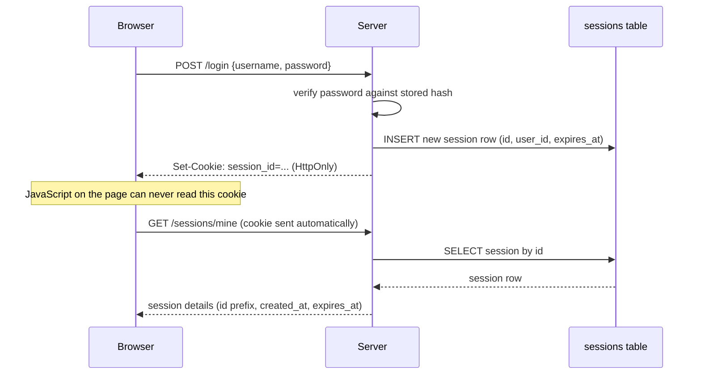
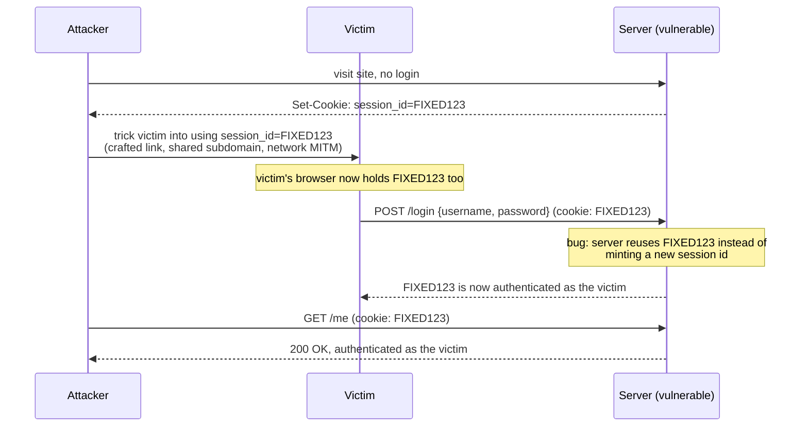

# Lab 00: sessions and cookies

You'll build a login system from scratch: a signup and login endpoint, a
server-side session store, and a cookie that ties a browser to that session.
Then you'll find two real bugs in it (plaintext passwords and a session
fixation hole) and fix both yourself.

This is the only lab in the course with no agents anywhere in it. Everything
here is the foundation the rest of the course builds on, so it's worth taking
slowly.

## What you'll learn

- What a session actually is on the server side, and what the cookie in the
  browser does and doesn't contain
- Why passwords must never be stored as-is, and what a password hash buys you
- What session fixation is, how an attacker exploits it, and the one-line fix
  that closes it
- How to read a structured audit log to see an authorization decision (allow
  or deny) as it happens, not just guess at it from a status code

## Background

### Sessions vs. the cookie

A cookie is just a string the browser sends back on every request to the
domain that set it. On its own it proves nothing. The security comes from
what's on the server: a session record that says "this opaque string
corresponds to user 42, created at this time, expiring at that time." The
cookie is a claim; the session record is the source of truth.



In this lab, `GET /sessions/mine` shows you both sides at once: the
`document.cookie` value your own JavaScript sees (empty, since the cookie is
`HttpOnly`), next to what the server actually holds for your session. Watch
the difference for yourself once you're running it.

### Why hash passwords

If your database is ever read by someone who shouldn't read it (a backup
that leaks, a misconfigured bucket, a SQL injection bug somewhere else
entirely), a plaintext password column hands them every user's real password
immediately. A password hash is a one-way function: easy to compute forward,
practically impossible to reverse. You check a login attempt by hashing the
submitted password and comparing hashes, never by storing or comparing the
original.

This lab uses [Argon2](https://en.wikipedia.org/wiki/Argon2), the winner of
the Password Hashing Competition and the current recommendation from OWASP.
Older systems you'll encounter in the wild often use bcrypt or PBKDF2
instead; the principle is identical even if the algorithm differs.

### Session fixation

Here's the attack this lab makes you fix. Suppose login "elevates" whatever
session the browser already presents, rather than issuing a fresh one:



The attacker was never near the victim's password. They just needed their
chosen session id to survive the victim's login. The fix is one rule:
**login always issues a brand-new session id**, and never reuses whatever
the client happened to send beforehand.

## Prerequisites

- Python 3.12
- Node.js (any recent version; the course was built and tested on Node 24)
- `uv` or plain `pip` for installing Python dependencies

## Setup

```sh
cd labs/lab-00-sessions-cookies/starter/backend
uv venv .venv --python 3.12
uv pip install -r requirements.txt --python .venv/bin/python
```

```sh
cd labs/lab-00-sessions-cookies/starter/frontend
npm install
```

## Your tasks

Open `starter/backend/app/security.py`. You'll find three functions marked
with a `TODO(lab-00)` comment.

### 1. Hash passwords properly

Right now, `hash_password` and `verify_password` look like this:

```python title="starter/backend/app/security.py"
def hash_password(password: str) -> str:
    # TODO(lab-00): this stores the password as-is. Anyone who reads the
    # database (a backup, a leaked file, an SQL-injection bug elsewhere)
    # gets every user's real password. Hash it instead — see the "Password
    # Hashing" section of the lab 00 handout, and the `argon2` package
    # that's already a dependency.
    return password


def verify_password(password: str, password_hash: str) -> bool:
    # TODO(lab-00): this only works because hash_password() above doesn't
    # actually hash anything yet. Once you fix hash_password(), this needs
    # to verify against the hash, not compare raw strings.
    return password == password_hash
```

Fix both using the `argon2` package, which is already a dependency and
already imported at the top of the file. `PasswordHasher` (from
`argon2`) has a `.hash(password)` method for writes and a `.verify(hash,
password)` method for reads; the latter raises `VerifyMismatchError`
(already imported for you) on a mismatch rather than returning `False`
directly, so `verify_password` needs to catch that.

### 2. Stop session fixation

Further down the same file, `resolve_login_session_id` looks like this:

```python title="starter/backend/app/security.py"
def resolve_login_session_id(cookie_session_id: str | None) -> str:
    """What session id does a successful login issue?"""
    # TODO(lab-00): reusing whatever session id the client already sent (or
    # minting one only if none was sent) opens session fixation — an
    # attacker can set a victim's cookie *before* they log in, then reuse
    # that same session id afterward, now authenticated as the victim.
    # Always issue a fresh session id here instead. See "Session Fixation"
    # in the lab 00 handout.
    return cookie_session_id or new_session_id()
```

Fix it so a successful login always mints a fresh session id, ignoring
`cookie_session_id` entirely. `new_session_id()` is already defined a few
lines above and does exactly what its name says.

!!! warning "Don't just delete the parameter"
    It's tempting to simplify the function signature once you stop using
    `cookie_session_id`. Leave it as-is for this lab: a later lab reuses this
    same shape when a request needs to compare an incoming credential against
    a freshly-issued one.

### 3. Run it and watch it work

Start the backend and frontend in two terminals:

```sh
cd labs/lab-00-sessions-cookies/starter/backend
.venv/bin/uvicorn app.main:app --reload
```

```sh
cd labs/lab-00-sessions-cookies/starter/frontend
npm run dev
```

Open the frontend (Vite will print the local URL, normally
`http://localhost:5173`). Sign up, log in, and look at the session inspector
panel: it shows you `document.cookie` as your own JavaScript sees it next to
what the server actually holds for your session, matching the first diagram
above. Below that, the audit log panel updates live every time you log in,
log out, or get denied.

## You're done when

Run the self-check suite from `starter/backend`:

```sh
.venv/bin/pytest tests/ -v
```

- [ ] `test_password_hashing_round_trips` passes: a password hashes to
      something other than itself, and only the right password verifies
      against it
- [ ] `test_password_stored_hashed_not_plaintext` passes: the database
      column never contains the raw password
- [ ] `test_session_id_rotates_on_login_session_fixation` passes: a
      pre-existing cookie is never reused as the post-login session id
- [ ] Every other test in the suite still passes (they should, untouched,
      from the start; if one of them broke, you changed something you
      didn't mean to)
- [ ] In the browser, the session inspector shows a session id, a creation
      time, and a countdown, and the audit log shows an `allow` entry for
      your login

## Going further

These don't have a self-check. Try them, then decide for yourself whether
your answer holds up. Lab 01's handout opens with a discussion of these.

1. This lab hashes session tokens nowhere: the raw session id sits in the
   `sessions` table exactly as it's sent in the cookie. What's the actual
   risk if someone reads that table directly, and what would you change to
   reduce it?
2. The session TTL is a flat 30 minutes from creation, with no concept of
   "still active, extend it" versus "abandoned, let it die." Design a sliding
   expiration and explain what new failure mode it introduces.
3. Right now, logging out deletes exactly one session row: the one tied to
   the cookie you're holding. If a user is logged in on three devices and
   suspects one of them is compromised, they have no way to revoke just that
   one, or all of them at once. Sketch the data model change that would let
   them do either.
4. `SESSION_TTL_SECONDS` is a constant. What would break if two different
   parts of the system needed different session lifetimes (say, a
   short-lived admin session next to a long-lived regular one)?

## Further reading

- [OWASP Session Management Cheat Sheet](https://cheatsheetseries.owasp.org/cheatsheets/Session_Management_Cheat_Sheet.html)
- [OWASP Password Storage Cheat Sheet](https://cheatsheetseries.owasp.org/cheatsheets/Password_Storage_Cheat_Sheet.html)
- Production systems rarely hand-roll session and password logic the way
  this lab does. [Keycloak](https://www.keycloak.org/) is the tool you'd
  reach for instead, and you'll meet it (by name, not by installing it) in
  Lab 04.
