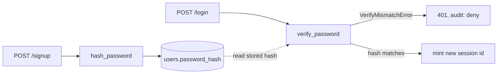
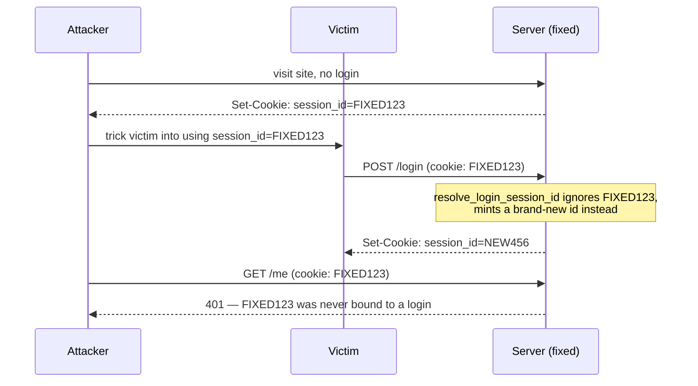
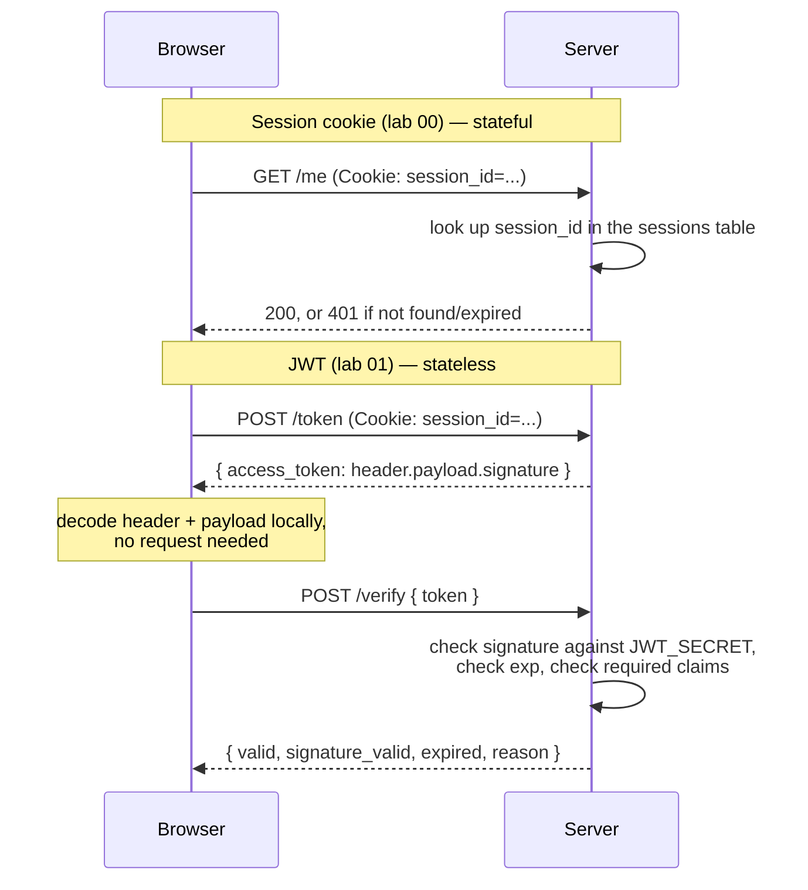
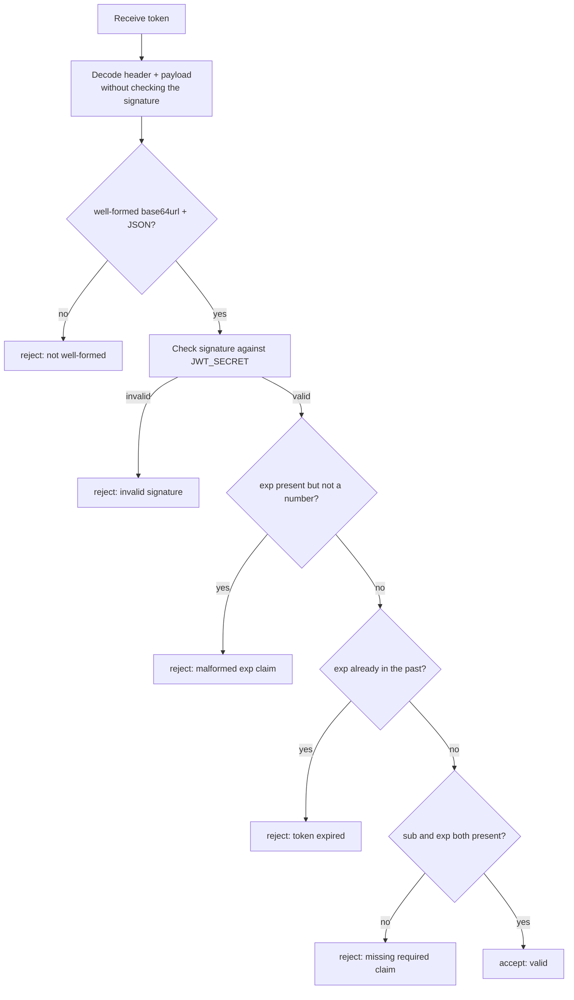

# Lab 01: JWTs

You'll add a second way to prove identity to the system you built in lab 00:
a signed, self-contained token instead of a server-side session. By the end,
your backend issues JWTs, verifies them properly (signature and expiry, not
just the base64), and your frontend has a live decoder that shows exactly
what a JWT does and doesn't protect.

## What you'll learn

- What actually makes a JWT trustworthy, and why decoding one is not the
  same as verifying one
- How to reject a tampered signature, an expired token, and a token missing
  a required claim, each for a distinct reason
- Why a session cookie and a JWT solve the same problem (proving who you
  are on a later request) with opposite trade-offs

## Closing the loop on lab 00

### The password hashing fix

Lab 00 started you off with `hash_password` and `verify_password` storing
and comparing passwords as-is. The fix swaps in Argon2:

```python title="solution/backend/app/security.py"
def hash_password(password: str) -> str:
    return _hasher.hash(password)


def verify_password(password: str, password_hash: str) -> bool:
    try:
        _hasher.verify(password_hash, password)
        return True
    except VerifyMismatchError:
        return False
```

`PasswordHasher.hash()` produces a string that encodes the algorithm,
its parameters, a random salt, and the derived hash, all together, so two
users with the same password never end up with the same stored value.
`verify()` takes the stored hash and a plaintext guess and redoes the same
derivation, comparing the result in constant time. It raises
`VerifyMismatchError` on a mismatch instead of returning `False`, which is
why `verify_password` needs the `try`/`except` rather than a plain
`==` check.



### The session fixation fix

`resolve_login_session_id` used to reuse whatever session id the client
already presented, which is what let an attacker plant a cookie in a
victim's browser before they logged in and inherit their session
afterward. The fix ignores that entirely:

```python title="solution/backend/app/security.py"
def resolve_login_session_id(cookie_session_id: str | None) -> str:
    """What session id does a successful login issue?"""
    return new_session_id()
```

The parameter is still there even though the function no longer looks at
it. That's a side effect of how the starter is generated, not a design
choice about this function specifically: `scripts/generate_starter.py`
swaps the function *body* between the `LAB:SOLUTION` and `LAB:STARTER`
blocks, but the `def` line itself is written once and shared by both. The
starter's buggy body still reads `cookie_session_id`, so the signature has
to keep accepting it, whether or not the fixed body above uses it.



### Discussing lab 00's going further questions

These aren't graded, and what follows is one take, not the only correct
one.

**Hashing the session token at rest.** Right now, anyone who reads the
`sessions` table directly gets a live, valid session id they can drop
straight into a cookie: it's exactly as sensitive as a plaintext password
would be, for the same reason. Store a hash of the session id (a fast one,
like SHA-256, is fine here, since the id already has 256 bits of entropy
and doesn't need Argon2's slow, salted design) and look sessions up by
hashing the incoming cookie value and matching against the stored hash. The
cookie itself is unaffected; only what a backup or an SQL injection bug
would leak changes.

**Sliding expiration.** Extending the TTL on every authenticated request
solves the "still active, don't log me out" problem, but it opens a new
one: a stolen session, used regularly by the attacker, never expires
either. Any sliding-expiration design needs a second, absolute ceiling
(say, 12 hours from creation, no matter how active the session stays) that
sliding renewal can't push past, otherwise "still active" and "compromised
and being actively abused" look identical from the server's side.

**Per-device revocation.** The current schema has no concept of "device" at
all, just a session row per login. Add a label (say, a hash of the
`User-Agent` header plus a rough client fingerprint, captured at login) to
each session row, list sessions grouped by that label in a "your devices"
panel, and offer both a delete-one-row and a delete-all-rows-for-this-user
endpoint. The interesting design question isn't the schema, it's how much
you trust a `User-Agent` string as a device identity given how easy it is
to spoof.

**Per-context TTLs.** `SESSION_TTL_SECONDS` being a module constant means
every session gets the same lifetime regardless of what it's for. The
straightforward fix is moving the TTL from the constant into a column on
the session row, decided by whatever calls `session_expiry()` at creation
time rather than by the function itself. The harder question it raises:
once TTL is a per-session decision, something has to decide it, which
means introducing the concept of "what kind of session is this" before
you've built anything that would tell you.

## Background

### Signed, not encrypted

A JWT looks like three base64url-encoded chunks joined with dots: a
header, a payload, and a signature. The header and payload are just JSON.
Nothing about them is encrypted, so anyone holding the token, your
frontend, a browser extension, a proxy in the middle, can decode and read
every claim without knowing any secret at all. That's not a bug. It's the
whole design: a JWT is meant to be self-describing.

What the secret actually buys you is the third chunk. The signature is
computed over the header and payload using a key only the issuing server
holds, and it's the only part that isn't attacker-editable without
detection. Read the claims, and you know what the token *claims*. Check
the signature, and you know whether to believe it.



Notice what changed between the two halves of that diagram. The session
flow needs the database on every request, because the cookie is only an
opaque reference. The JWT flow needs the database for nothing (it's
already stateless), but it needs the one thing the browser never has: the
key that made the signature genuine in the first place.

### What "verify" actually has to check

A JWT verification function that only decodes the payload and calls it
done is the trap this lab exists to catch you in. A real verify has at
least three independent ways to fail, and conflating them (or skipping any
of them) is how "JWT auth" ends up meaning "anyone can forge a token by
hand."



The order matters. A signature check has to run before you trust anything
else about the token, including whether it's expired, because a forged
token can claim any `exp` it likes. This lab's self-check suite exercises
each rejection path separately and expects a distinct reason string for
each: `"invalid signature"`, `"malformed exp claim"`, `"token expired"`,
and `"missing required claim: <name>"`. A verify function that collapses
these into one generic "invalid token" makes debugging (and this handout's
audit-log tests) much harder than it needs to be.

Watch out for a subtler trap in that ordering: a token can be genuinely
signed with the real secret and still carry an `exp` that isn't a number
at all (a hand-edited payload with `"exp": "soon"`, say). PyJWT's own
built-in expiry check tries to convert `exp` to an integer during
verification and raises an error if it can't — an error that looks
exactly like a signature failure to code that isn't careful about it. A
malformed `exp` is a real problem, but it isn't a signature problem, and
reporting it as `"invalid signature"` would blame the wrong thing.

## Prerequisites

- Python 3.12
- Node.js (any recent version; the course was built and tested on Node 24)
- `uv` or plain `pip` for installing Python dependencies
- Lab 00 completed, since this lab's starter is lab 00's finished solution
  plus one new gap

## Setup

```sh
cd labs/lab-01-jwt/starter/backend
uv venv .venv --python 3.12
uv pip install -r requirements.txt --python .venv/bin/python
```

```sh
cd labs/lab-01-jwt/starter/frontend
npm install
```

## Your tasks

Open `starter/backend/app/security.py` and find `verify_token`, marked
with a `TODO(lab-01)` comment:

```python title="starter/backend/app/security.py"
def verify_token(token: str) -> TokenVerification:
    """Check a JWT for real: signature, expiry, and required claims.

    Decoding the payload is always possible without the secret — that part
    of a JWT is base64url, not encrypted. Proving the token wasn't tampered
    with, and hasn't expired, needs the actual signature check below.
    """
    # TODO(lab-01): this reads the claims out of the token but never checks
    # whether the signature is genuine — jwt.decode() below is called with
    # verify_signature=False, so it happily accepts a token whose payload
    # was hand-edited and re-encoded, as long as the JSON is well-formed. A
    # JWT's payload is base64url, not encrypted: readable by anyone, proven
    # authentic by no one, until the signature is actually checked against
    # the key that issued it. Verify the signature for real instead of
    # skipping it — decode with the secret and `algorithms=[JWT_ALGORITHM]`,
    # no `verify_signature` override — and handle the distinct failure
    # cases (bad signature, expired, missing claim) it can raise. See
    # "Signed, Not Encrypted" in the lab 01 handout.
    claims = jwt.decode(token, options={"verify_signature": False})

    now = time.time()
    claimed_exp = claims.get("exp")
    exp_present = "exp" in claims
    exp_well_formed = isinstance(claimed_exp, (int, float))
    expired = exp_well_formed and claimed_exp < now
    if exp_present and not exp_well_formed:
        return TokenVerification(
            valid=False, signature_valid=True, expired=False, claims=claims,
            reason="malformed exp claim",
        )
    if expired:
        return TokenVerification(
            valid=False, signature_valid=True, expired=True, claims=claims,
            reason="token expired",
        )

    missing = [claim for claim in REQUIRED_CLAIMS if claim not in claims]
    if missing:
        return TokenVerification(
            valid=False, signature_valid=True, expired=False, claims=claims,
            reason=f"missing required claim: {missing[0]}",
        )

    return TokenVerification(valid=True, signature_valid=True, expired=False, claims=claims)
```

Notice this already gets expiry and missing-claim checking right. It's
`signature_valid=True` that's the lie: nothing above it ever checked a
signature against anything, so a token whose payload was hand-edited and
re-signed with a wrong key (or not signed at all) sails through unless it
also happens to be expired or missing a claim.

Fix `verify_token` so it actually verifies the signature: call
`jwt.decode(token, JWT_SECRET, algorithms=[JWT_ALGORITHM])` and let PyJWT
do the cryptographic check, instead of the `verify_signature=False`
override above. That call raises `jwt.InvalidTokenError` (or one of its
subclasses) when the signature doesn't check out, so you'll need to catch
it and translate it into `signature_valid=False` with reason
`"invalid signature"`.

One thing to get right on the way there: that verifying call also runs
PyJWT's own built-in expiry check by default, which means it can raise for
a malformed `exp` claim too, not just a bad signature — and if you let
that exception fall into the same "bad signature" handling, you'll
misreport a malformed `exp` as a forged token. Keep the signature check
and the exp-shape check as two separate concerns: tell `jwt.decode` not to
do its own expiry validation on this call (there's an `options` argument
for that), and rely on the unverified-claims read you already have above
to decide, on your own terms, whether `exp` is present, whether it's
actually a number, and whether it's in the past — the existing
expiry/missing-claim logic keeps applying once you know the signature
genuinely checked out.

!!! warning "Peeking at claims and verifying them are different operations"
    You can (and should) still decode the payload without verification
    first, exactly like the starter does, if you want to read `exp` or the
    other claims before you know whether to trust them. Just don't let
    that unverified read stand in for the real signature check.

### Run it and watch it work

Start the backend and frontend in two terminals:

```sh
cd labs/lab-01-jwt/starter/backend
.venv/bin/uvicorn app.main:app --reload
```

```sh
cd labs/lab-01-jwt/starter/frontend
npm run dev
```

Log in, then scroll to the "Live JWT decoder" panel. Click "Get a fresh
token for my session": the claims decode instantly, client-side, no
network call involved. Click "Verify signature & expiry with server," and
you'll see a second, separate result that only the backend could produce.
Then try pasting a token with a character changed in the signature part
(the third dot-separated chunk) and verify it again: the local decode
still works fine (that's the point), but the server verification now comes
back invalid.

## You're done when

Run the self-check suite from `starter/backend`:

```sh
.venv/bin/pytest tests/ -v
```

- [ ] `test_verify_rejects_tampered_signature` passes: a token with an
      edited signature is rejected with reason `"invalid signature"`
- [ ] `test_verify_rejects_expired_token` passes: a token whose `exp` is in
      the past is rejected with reason `"token expired"`
- [ ] `test_verify_rejects_missing_required_claim` passes: a token missing
      `sub` is rejected with reason naming the missing claim
- [ ] `test_verify_reports_malformed_exp_as_its_own_reason_not_bad_signature`
      passes: a genuinely-signed token with a non-numeric `exp` is reported
      as `signature_valid=True` with reason `"malformed exp claim"`, not
      blamed on the signature
- [ ] `test_verify_denials_produce_distinct_audit_reasons` passes: all
      three denial reasons show up as separate audit log entries
- [ ] `test_verify_unit_level_distinct_errors` passes: calling
      `verify_token()` directly produces the same three distinct outcomes
- [ ] Every other test in the suite still passes, including everything
      carried over from lab 00
- [ ] In the browser, the JWT decoder panel shows decoded header/payload
      claims immediately after fetching a token, and shows a separate
      "signature valid" / "expired" result only after you click verify
- [ ] Tampering with a pasted token's signature still decodes locally but
      fails server verification, and that denial appears in the audit log
      panel with a reason of `"invalid signature"`

## Going further

No self-check for these. Lab 02's handout opens with a discussion of them.

1. This lab's JWT has no refresh flow: once `exp` passes, the only way to
   get a new one is to still hold a valid session cookie and hit `/token`
   again. What happens to a caller that only ever received the JWT (say, a
   mobile client that never sees the cookie) once it expires, and what
   would you need to add to let it recover without asking the user to log
   in again?
2. Lab 00's session table gives the server a lever it can pull instantly:
   delete the row, and the session is dead on the next request. A JWT has
   no equivalent until `exp` arrives on its own. Sketch what a revocation
   mechanism for JWTs would need to look like, and be honest about what it
   costs you in exchange for statelessness.
3. `JWT_SECRET` is one fixed symmetric key, known to whoever issues tokens
   and whoever verifies them, which in this lab is the same process. What
   breaks the moment a second, separate service needs to verify tokens it
   didn't issue, and how does switching to an asymmetric algorithm change
   who needs to hold what?
4. `verify_token` only requires `sub` and `exp`. If a future lab wants to
   gate access by role, where would that claim naturally live, and what
   happens to a token that was minted before that claim existed?

## Further reading

- [RFC 7519: JSON Web Token (JWT)](https://datatracker.ietf.org/doc/html/rfc7519)
- [jwt.io debugger](https://jwt.io/) — the same decode-without-a-secret
  trick this lab's UI panel does, from the library that popularized it
- [OWASP JSON Web Token Cheat Sheet](https://cheatsheetseries.owasp.org/cheatsheets/JSON_Web_Token_for_Java_Cheat_Sheet.html)
- [PyJWT documentation](https://pyjwt.readthedocs.io/)
