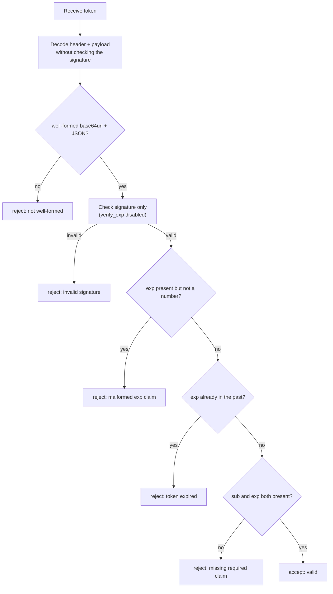
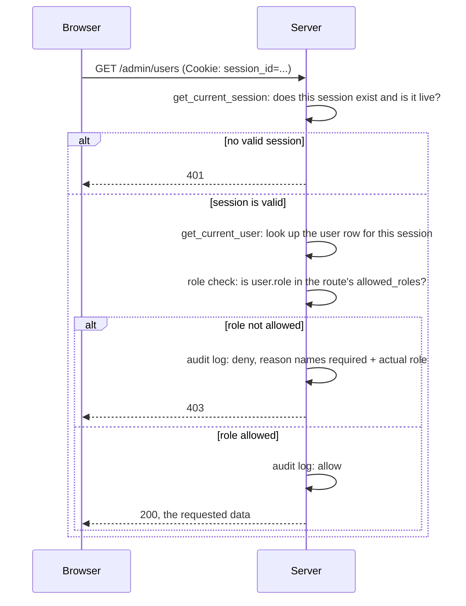
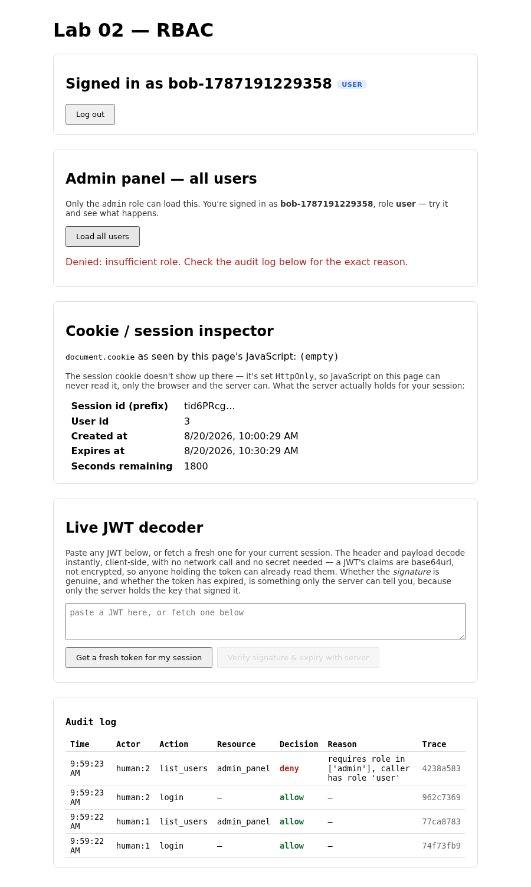

# Lab 02: RBAC

You'll give every user a role and build role-based access control, RBAC
for short: a dependency that gates a route to callers whose role is on an
allow-list, denying everyone else with a 403 and an audit entry that names
exactly what went wrong. By the end, your backend has a role-gated admin
panel, and you've watched a real privilege-escalation bug let a plain user
through it before you fix it.

## What you'll learn

- Why a role check has to compare against an allow-list, not just check
  that a role exists
- How to deny a request for a specific, distinguishable reason and make
  that denial show up in an audit trail, not just a 403 with no context
- What a self-service endpoint owes you: never trusting a role the caller
  didn't earn

## Closing the loop on lab 01

### The signature verification fix

Lab 01 started you off with `verify_token` reading a JWT's claims but
never checking whether the signature was genuine. The fix calls
`jwt.decode` with the real secret and lets PyJWT do the cryptographic
work. Lab 01's own handout already covers the full mechanics of the
finished version, including a wrinkle worth reinforcing here since it's
the whole reason the function is shaped the way it is: PyJWT's own expiry
check runs inside that same verifying call, and it can raise for a
malformed `exp` claim just as easily as for a forged signature. Letting
that exception fall into the same "bad signature" handling would
misreport a malformed `exp` as a forged token, exactly the conflation lab
01 taught you to keep separate. Here's the full fixed function:

```python title="solution/backend/app/security.py"
def verify_token(token: str) -> TokenVerification:
    """Check a JWT for real: signature, expiry, and required claims.

    Decoding the payload is always possible without the secret — that part
    of a JWT is base64url, not encrypted. Proving the token wasn't tampered
    with, and hasn't expired, needs the actual signature check below.
    """
    try:
        unverified_claims = jwt.decode(token, options={"verify_signature": False})
    except jwt.InvalidTokenError:
        return TokenVerification(
            valid=False, signature_valid=False, expired=False,
            reason="token is not well-formed",
        )

    now = time.time()
    claimed_exp = unverified_claims.get("exp")
    exp_present = "exp" in unverified_claims
    exp_well_formed = isinstance(claimed_exp, (int, float))
    expired = exp_well_formed and claimed_exp < now

    try:
        # verify_exp is turned off deliberately: this call's only job is
        # checking the signature. PyJWT's own exp handling (left on) would
        # try to int() a malformed exp claim and raise DecodeError — a
        # subclass of InvalidTokenError indistinguishable, in the except
        # branch below, from an actually-forged signature. A malformed exp
        # is a real, distinct problem (handled right below), but it isn't a
        # signature problem, and this function must not conflate the two.
        jwt.decode(
            token, JWT_SECRET, algorithms=[JWT_ALGORITHM],
            options={"verify_exp": False},
        )
        signature_valid = True
    except jwt.InvalidTokenError:
        signature_valid = False

    if not signature_valid:
        return TokenVerification(
            valid=False, signature_valid=False, expired=expired,
            claims=unverified_claims, reason="invalid signature",
        )

    if exp_present and not exp_well_formed:
        return TokenVerification(
            valid=False, signature_valid=True, expired=False,
            claims=unverified_claims, reason="malformed exp claim",
        )

    if expired:
        return TokenVerification(
            valid=False, signature_valid=True, expired=True,
            claims=unverified_claims, reason="token expired",
        )

    missing = [claim for claim in REQUIRED_CLAIMS if claim not in unverified_claims]
    if missing:
        return TokenVerification(
            valid=False, signature_valid=True, expired=False,
            claims=unverified_claims, reason=f"missing required claim: {missing[0]}",
        )

    return TokenVerification(valid=True, signature_valid=True, expired=False, claims=unverified_claims)
```

The `options={"verify_exp": False}` on the verifying call is doing the
real work here. It tells PyJWT "check the signature, and nothing else" so
the only way that call can raise is a genuine signature problem. Expiry
and claim shape get decided separately, from the unverified claims the
function already read at the top, on this function's own terms rather
than PyJWT's. That split is what lets a malformed `exp` get reported
honestly as `"malformed exp claim"` instead of getting blamed on a
signature that was never at fault.



Notice the signature check comes first and stands entirely on its own.
Everything below it, expired, malformed, missing, is a judgment this
function makes itself once it already knows the token is genuine. That
separation of concerns, one check per failure mode, no exception handler
doing double duty, is exactly what lab 01's background section spelled
out. Seeing it play out in the finished function is confirmation the
lesson landed, not a correction to it.

### Discussing lab 01's going further questions

These aren't graded, and what follows is one take, not the only correct
one.

**JWT refresh for a client with no session cookie.** A mobile client that
only ever holds the JWT has no `/token` endpoint it can hit again, because
that endpoint requires the session cookie this lab's JWT is layered on
top of. The usual fix is a second, longer-lived refresh token, opaque and
stored server-side (much like lab 00's session id), that the client
exchanges for a fresh short-lived JWT without re-entering a password. That
refresh token needs its own revocation story, since it's the thing that
now has to survive for days or weeks rather than the 15 minutes this
lab's access token lives for.

**Revocation for something stateless.** The honest answer is that you
can't revoke a JWT without giving up some of what made it attractive in
the first place. The two real options are a denylist (a small,
fast-to-check store of token IDs that shouldn't be trusted, checked on
every verify) or just living with the token's TTL as the ceiling on how
long a compromised token stays valid. A denylist reintroduces exactly the
per-request state lookup a JWT was supposed to let you avoid, just for a
narrower table. There's no way around that trade, only ways to make the
lookup cheap.

**Asymmetric keys for multi-service verification.** `JWT_SECRET` works
here because issuing and verifying happen in the same process. The moment
a second service needs to verify tokens it didn't issue, that service
either needs the same shared secret (which means every service that can
verify a token can also forge one) or the issuer switches to an
asymmetric algorithm like RS256, publishes the public key, and keeps the
private key to itself. Verification stays possible everywhere; forging a
token stays possible in exactly one place. The cost is key management: now
somebody has to rotate and distribute a public key, not just a string in
an environment variable.

**Where a role claim would live.** This is the one this lab actually
answers, though maybe not the way the question expects. `verify_token`
never gained a role claim. RBAC in this lab reads the caller's role from
the database, by way of the session, not from anything the JWT carries.
That sidesteps the stale-claim problem entirely: change a user's role in
the `users` table and the very next request sees it, no token to
reissue. The cost shows up the moment a service has to authorize a caller
using only a JWT, with no session lookup available, which is exactly the
shape of problem later labs in this course build toward.

## Background

### From "who are you" to "what can you do"

Everything through lab 01 answers one question: is this caller who they
claim to be. RBAC answers a second, separate question: given that they
are who they claim, are they allowed to do this specific thing. Sessions
and JWTs are both authentication. A role check is authorization, and it
has to run strictly after authentication succeeds, never instead of it.



The 401-versus-403 distinction matters and this lab's tests check it
directly. A missing or expired session is "I don't know who you are," and
gets 401. A session that's perfectly valid but belongs to the wrong role
is "I know exactly who you are, and the answer is no," and gets 403. Two
different failures, two different codes, two different audit reasons.

### What the role check actually has to compare

The naive way to write a role check is to ask "does this user have a
role at all." Every signed-up user in this system gets the non-empty
role `"user"` by default, so a check that only asks "is `role` truthy"
passes for literally everyone, admin-only route or not. The check has to
ask a narrower question: is this specific role one of the roles this
specific route accepts.

```mermaid
flowchart LR
    subgraph Buggy["Truthiness check"]
        A1["role = 'user'"] --> A2{"if role:"}
        A2 -->|non-empty, so yes| A3["allowed — wrong!"]
    end
    subgraph Fixed["Membership check"]
        B1["role = 'user'"] --> B2{"if role in allowed_roles:"}
        B2 -->|'user' not in ['admin']| B3["denied — correct"]
    end
```

This is a real category of bug, not a contrived one. It shows up whenever
someone writes a role gate as "does the caller have some kind of
authorization marker" instead of "does the caller have *this*
authorization marker," and it's easy to miss in review because the
buggy version still compiles, still runs, and still denies a caller with
no role at all. It just fails to deny the much more common caller who has
some role, only the wrong one.

## Prerequisites

- Python 3.12
- Node.js (any recent version; the course was built and tested on Node 24)
- `uv` or plain `pip` for installing Python dependencies
- Lab 01 completed, since this lab's starter is lab 01's finished solution
  plus one new gap

## Setup

```sh
cd labs/lab-02-rbac/starter/backend
uv venv .venv --python 3.12
uv pip install -r requirements.txt --python .venv/bin/python
```

```sh
cd labs/lab-02-rbac/starter/frontend
npm install
```

The database seeds one working admin account so the admin panel has
something to show you before you've built anything yourself: username
`admin`, password `lab02-admin-do-not-reuse`. That's a fixed, checked-in
credential for local teaching use only, exactly like lab 01's
`JWT_SECRET` before it. Never reuse a hardcoded credential like this
outside a localhost exercise; a real system provisions its first admin
through a separate, audited bootstrap step, not a password baked into
source control that every clone of the repo shares.

## Your tasks

Open `starter/backend/app/security.py` and find `role_is_authorized`,
marked with a `TODO(lab-02)` comment:

```python title="starter/backend/app/security.py"
def role_is_authorized(role: str, allowed_roles: tuple[str, ...]) -> bool:
    """Does `role` satisfy the RBAC check for a route that only admits one
    of `allowed_roles`?

    Kept as a standalone, dependency-free predicate — same reason
    `verify_token` above is a plain function rather than living inline in a
    FastAPI route — so it can be unit-tested directly, without spinning up
    the app or a session.
    """
    # TODO(lab-02): this checks whether the caller *has* a role at all, not
    # whether it's one of `allowed_roles`. Every signed-up user gets the
    # non-empty role "user" by default (see app/main.py's signup handler),
    # so `bool(role)` is True for literally every authenticated caller,
    # admin-gated route or not — a plain "user" satisfies this check just
    # as easily as an actual admin does. Compare `role` against
    # `allowed_roles` for real instead of just checking it's non-empty. See
    # "What the Role Check Actually Has to Compare" in the lab 02 handout.
    return bool(role)
```

!!! danger "Intentionally vulnerable code: localhost teaching only"
    The code above is this lab's seeded privilege-escalation bug, the
    kind ADR-0008 governs for this course: labeled at the point of
    vulnerability, never wired to anything beyond your own machine, and
    paired with the fix before this lab ends. Every self-signed-up user
    gets the role `"user"`, a non-empty string, so `bool(role)` is `True`
    for every one of them. Point this check at an admin-only route and a
    plain user walks straight through it. Don't run this version anywhere
    but your own localhost, and don't ship this pattern anywhere real:
    the next section fixes it in this same lab.

This function is everything `require_role` in `app/main.py` depends on to
decide who gets through. Fix it so it checks `role` against
`allowed_roles` for real, a genuine membership test, not a truthiness
test. Nothing about `require_role` itself, the FastAPI dependency that
calls this function and writes the audit log entry, needs to change; the
whole bug and the whole fix live in this one function.

!!! warning "A role existing and a role matching are different questions"
    A genuine membership check already covers the no-role case on its
    own, with nothing extra to write: an empty string is never a member
    of a non-empty allow-list tuple, so it's correctly denied by the same
    comparison that denies any other role that isn't on the list. The
    trap isn't a missing edge case, it's writing a check that only asks
    whether `role` exists at all, a different and much weaker question
    than asking whether it's one of the roles this specific route
    accepts.

### Run it and watch it work

Start the backend and frontend in two terminals:

```sh
cd labs/lab-02-rbac/starter/backend
.venv/bin/uvicorn app.main:app --reload
```

```sh
cd labs/lab-02-rbac/starter/frontend
npm run dev
```

Sign up as a new user and log in. You'll see your role badge, `user`,
next to your name. Click "Load all users" in the admin panel: with the
bug still in place, this succeeds, and you'll see every user in the
system including the seeded admin account, despite never having admin
access yourself. That's the escalation actually happening, not a
hypothetical. Fix `role_is_authorized`, restart the backend, and try
again: the same click now fails, with a denial visible right there in the
panel and a matching entry in the audit log below it, naming the role
the route required and the role you actually had.



Log out and log back in as the seeded `admin` account to see the same
click succeed instead.

## You're done when

Run the self-check suite from `starter/backend`:

```sh
.venv/bin/pytest tests/ -v
```

- [ ] `test_role_is_authorized_exact_match` passes: a role that isn't in
      the allow-list is denied, even though it's non-empty
- [ ] `test_plain_user_denied_admin_panel` passes: a freshly signed-up
      user is denied the admin panel with a 403, and that denial produces
      an audit event naming both the required and the actual role
- [ ] `test_admin_panel_denial_reason_names_both_roles` passes: the audit
      reason string is specific enough to tell one denial cause from
      another
- [ ] `test_admin_can_list_users` passes: the seeded admin account can
      load the user list
- [ ] `test_admin_panel_requires_login_before_role_check` passes: no
      session at all gets 401, not 403, before the role check ever runs
- [ ] Every other test in the suite still passes, including everything
      carried over from labs 00 and 01
- [ ] In the browser, logging in as a plain user and clicking "Load all
      users" shows a denial message in the panel itself, not a silently
      missing section, and the audit log panel shows a matching `deny`
      row with a reason naming both roles
- [ ] Logging in as the seeded `admin` account and clicking the same
      button loads the full user list, with a matching `allow` row in the
      audit log

## Going further

No self-check for these. Lab 03's handout opens with a discussion of
them.

1. Every user in this lab has exactly one role, stored as a single column.
   What would need to change, in the schema and in `role_is_authorized`
   itself, for a user to legitimately hold two roles at once, and what
   should happen to a route that lists several roles in its own allow-list
   when a caller matches more than one of them?
2. RBAC here reads the caller's role from the database on every request,
   by way of the session, which is exactly why a role change takes effect
   immediately, no token to reissue. What would it cost to also carry a
   role claim inside the JWT for services that only ever see the token,
   never a session lookup, and how would you handle a token minted before
   a user's role was changed?
3. `require_role` can express "any admin can call this route" but nothing
   finer, like "you can edit documents you created but not documents
   somebody else created." What does a check like that need to know that
   a flat role never captures, and is "role" even still the right word for
   it?
4. The audit log records exactly who was denied and why, but nothing here
   reacts to that pattern happening. If the same non-admin account hit
   `/admin/users` a hundred times in a minute, what, if anything, should
   the system do differently than it does after the first denial?

## Further reading

- [OWASP Top 10: A01:2021, broken access control](https://owasp.org/Top10/A01_2021-Broken_Access_Control/)
- [NIST: Role Based Access Control](https://csrc.nist.gov/projects/role-based-access-control)
- [OWASP Cheat Sheet: Authorization Testing Automation](https://cheatsheetseries.owasp.org/cheatsheets/Authorization_Testing_Automation_Cheat_Sheet.html)
