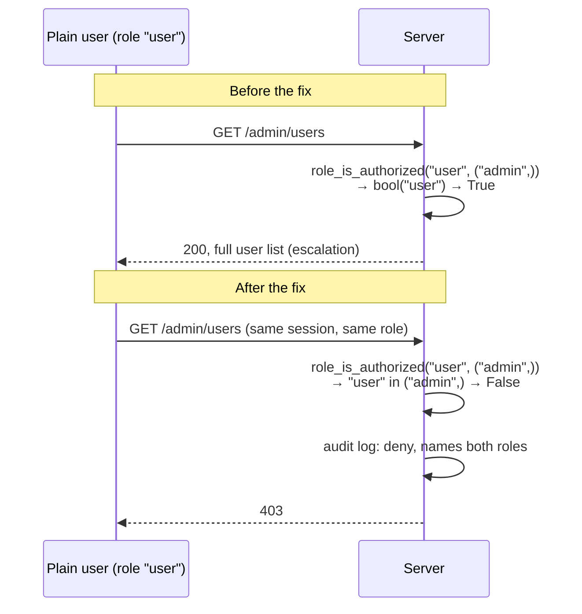
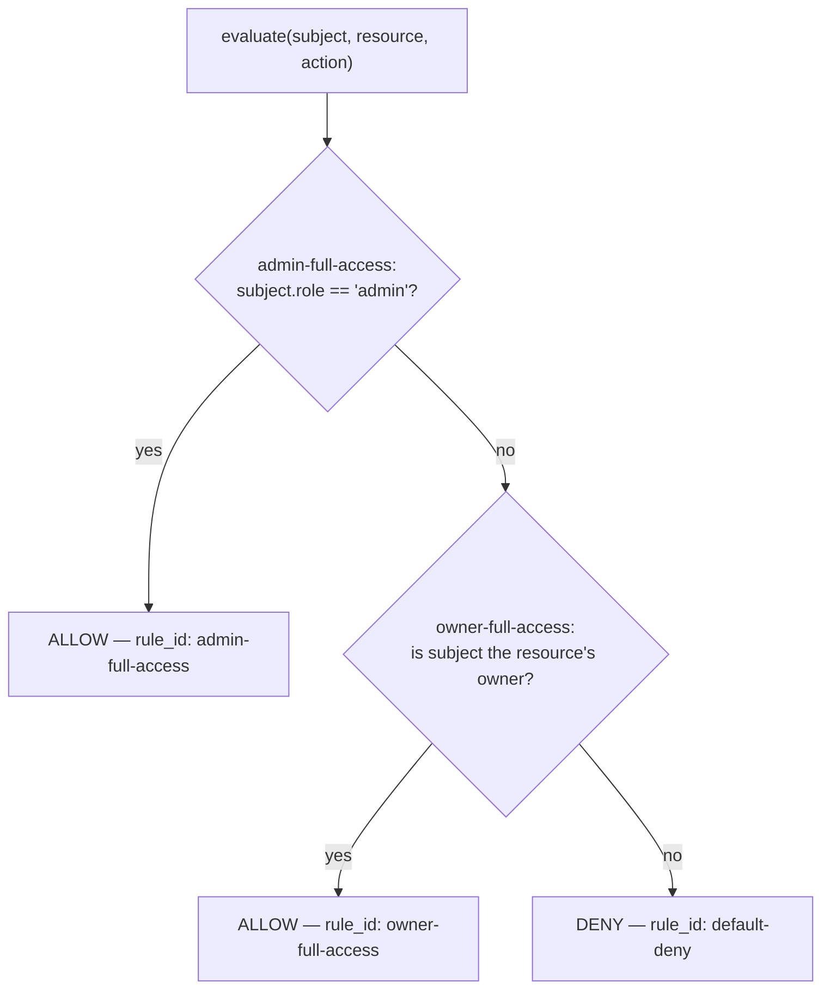
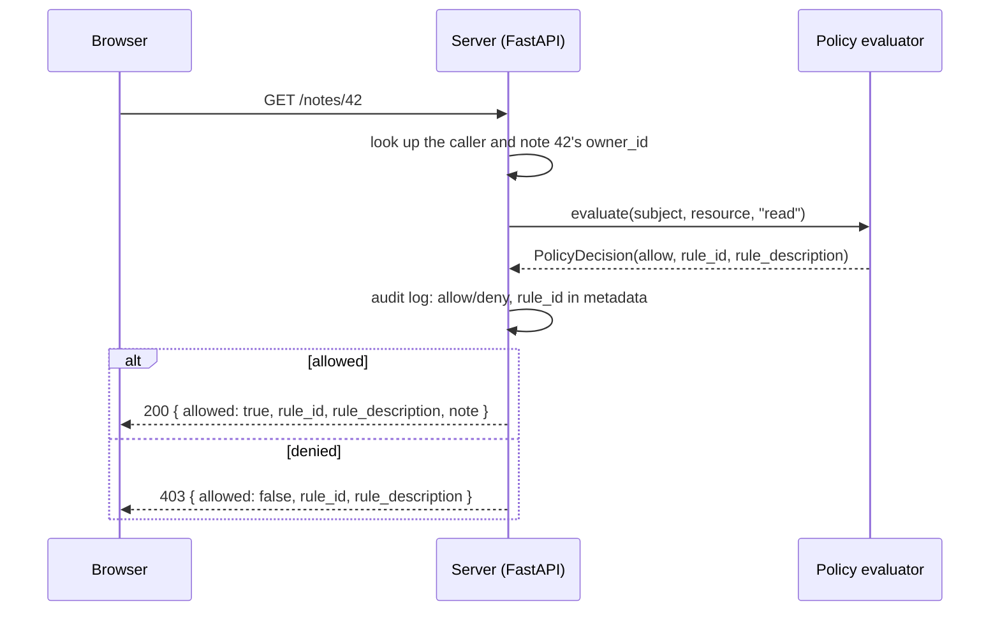
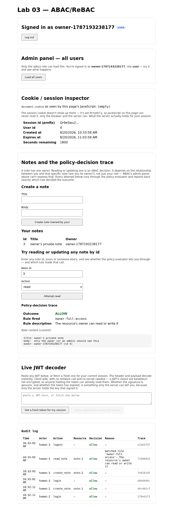
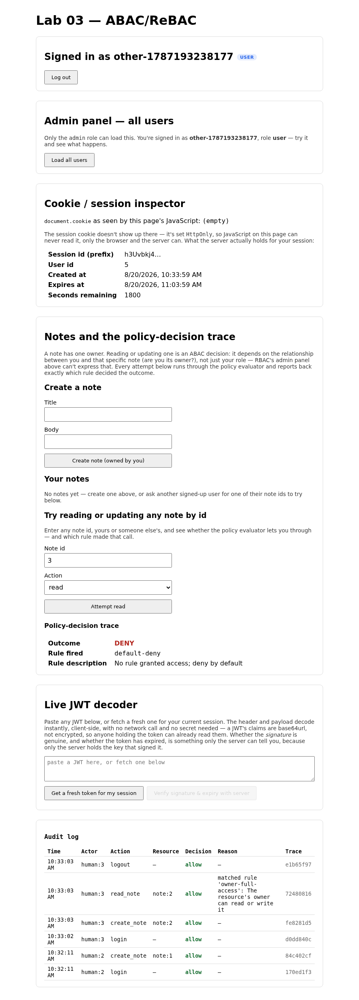

# Lab 03: ABAC/ReBAC

RBAC gave every route one question to ask: does this caller's role appear
on an allow-list. That's the right question for an admin panel, and the
wrong one the moment two callers share a role but shouldn't share access,
like two ordinary users who each have notes of their own. This lab adds a
second, finer-grained evaluator that decides access per resource, and a
trace viewer that shows exactly which rule made the call.

## What you'll learn

- Why some authorization decisions need the resource's own attributes, not
  just the caller's role
- How to write a policy evaluator as an ordered list of rules, each with
  its own id, so a decision points at the specific rule that produced it
- How to keep a resource's owner from ever coming out of anything the
  caller supplies on the request

## Closing the loop on lab 02

### The membership-check fix

Lab 02 started `role_is_authorized` off checking `bool(role)`, which is
true for every signed-up user because everyone gets the non-empty role
`"user"` by default. The fix is one word different, comparing `role`
against the actual allow-list instead of just checking it exists:

```python title="solution/backend/app/security.py"
def role_is_authorized(role: str, allowed_roles: tuple[str, ...]) -> bool:
    """Does `role` satisfy the RBAC check for a route that only admits one
    of `allowed_roles`?

    Kept as a standalone, dependency-free predicate — same reason
    `verify_token` above is a plain function rather than living inline in a
    FastAPI route — so it can be unit-tested directly, without spinning up
    the app or a session.
    """
    return role in allowed_roles
```

The diagram is really about what changes underneath that one line, not the
line itself. Here's the same request, `GET /admin/users` from a plain
user, before and after:



Nothing about `require_role` or the route itself changed. The caller,
their role, and the route's allow-list are all identical in both runs.
The only thing that moved is what `role_is_authorized` actually compares,
which is exactly why this bug is easy to miss in review: the buggy version
still type-checks, still returns a bool, and still denies a caller with no
role at all. It just can't tell "has a role" from "has the right one."

### Discussing lab 02's going further questions

One perspective, not a graded answer key.

**Multiple roles per user.** The schema change is a join table,
`user_roles(user_id, role)`, replacing the single `role` column. The more
interesting change is in `role_is_authorized` itself: it stops taking one
role and starts taking a collection, and the check becomes "does the
intersection of the caller's roles and the route's allowed roles have
anything in it." A caller who matches more than one allowed role doesn't
need special handling here, since this is a plain allow-list, not a
ranking. The moment two roles disagree about something, like one granting
an action and another denying it, is the moment this stops being a simple
allow-list and starts needing an explicit precedence rule, which this
course doesn't build.

**A role claim in the JWT.** You could add it, and services that only ever
see a token, never a session, would need to. The cost is exactly the one
lab 01 already flagged for revocation: a JWT claim is a snapshot from
issue time, so a role change made in the `users` table after that doesn't
take effect until the token expires and gets reissued. The 15-minute TTL
this course already uses bounds how stale that snapshot can get, which is
a real answer, just not a satisfying one if you need the change to apply
immediately.

**Fine-grained, per-resource checks.** This is the one this lab actually
answers. `require_role` can only express "does this caller's role clear
the bar for this whole route," and a check like "edit documents you
created" needs to know something about the specific document, not just
the caller. Whether "role" is still the right word for that: not really.
It's a different kind of attribute (a relationship between a caller and
one resource, not a caller's own property), and this lab treats it that
way.

**Reacting to repeated denials.** Nothing here currently does. Every
denial gets an audit event with a trace id, which is enough to build a
tally, an actor, and a count in a rolling window, from what already exists
without adding a new code path. The system doesn't act on that tally yet;
somebody would have to decide what "act" means (throttle, alert, lock the
account) and build it, which stays out of scope for this course. It's
worth noticing what it would need: the audit log already contains the
signal, it just isn't watched.

## Background

### One more question than RBAC can ask

RBAC decides "does this role get in the door," once, for a whole route.
That's the right shape when the answer really is the same for every
caller with that role, like the admin panel. It's the wrong shape for
"can this caller read this specific note," where the answer depends on
which note. Attribute-based access control (ABAC) and relationship-based
access control (ReBAC) both answer that narrower question by looking at
attributes of the resource, and the relationship between the caller and
that resource, not just the caller's role. This lab's version needs
exactly one relationship: is the caller the resource's owner.

### Rules as data, not a pile of ifs

ADR-0007 asks for a policy evaluator where a decision can point at the
specific rule that produced it, by id. Writing that as nested
`if`/`elif` gets you an allow or a deny, but not a name for the branch
that ran. This lab's evaluator instead holds an ordered list of rule
objects, each with an id, a description, and a condition function, and
walks the list until one matches:



`default-deny` sits at the end and matches unconditionally, so every call
to `evaluate()` returns something concrete: an allow or a deny, and the id
of whichever rule decided it. That last part is what the trace viewer
actually shows, and what the audit log actually stores alongside the
allow/deny outcome. Here's what a single request looks like end to end:



One thing worth sitting with even though this lab's three rules don't hit
it: rule order matters. A rule list is walked top to bottom and the first
match wins, so a broad rule placed ahead of a narrow one can silently
swallow every case the narrow rule was meant to handle. Nothing here
triggers that today, since `admin-full-access` and `owner-full-access`
don't overlap in who they match, but it's the kind of bug that gets easier
to write, not harder, as a rule list grows.

## Prerequisites

- Python 3.12
- Node.js (any recent version; the course was built and tested on Node 24)
- `uv` or plain `pip` for installing Python dependencies
- Lab 02 completed, since this lab's starter is lab 02's finished solution
  plus one new gap

## Setup

```sh
cd labs/lab-03-abac-rebac/starter/backend
uv venv .venv --python 3.12
uv pip install -r requirements.txt --python .venv/bin/python
```

```sh
cd labs/lab-03-abac-rebac/starter/frontend
npm install
```

The seeded admin account carries forward unchanged from lab 02: username
`admin`, password `lab02-admin-do-not-reuse`. Same fixed, checked-in,
localhost-only credential, same caveat: never reuse it anywhere real.

## Your tasks

Open `starter/backend/app/policy.py` and find `_is_owner`, marked with a
`TODO(lab-03)` comment:

```python title="starter/backend/app/policy.py"
def _is_owner(subject: Subject, resource: ResourceAttrs, action: str) -> bool:
    """Is `subject` the resource's owner? The one attribute-vs-relationship
    check this whole lab exists to teach: it has to compare the *caller* to
    the resource, not the resource to itself."""
    # TODO(lab-03): this compares the resource's owner_id to itself, which
    # is trivially always True, instead of comparing it to the caller's
    # subject.id. Since `admin-full-access` below only catches actual
    # admins, every OTHER authenticated caller falls through to this rule
    # next — and with this comparison, this rule matches for all of them,
    # owner or not. Any logged-in user ends up able to read and overwrite
    # anyone else's note, not just their own. Compare the two ids for real.
    return resource.owner_id == resource.owner_id
```

!!! danger "Intentionally vulnerable code — localhost teaching only"
    This is a real ABAC bypass, in the same spirit ADR-0008 calls out for
    lab 00's plaintext passwords and lab 02's privilege escalation, even
    though ADR-0008 doesn't name this lab specifically: it's an actual
    authorization hole, not a hypothetical one. Any signed-in user, not
    just the note's real owner, currently passes `owner-full-access` for
    every note in the system. Don't run this version anywhere but your own
    machine, and don't ship this pattern anywhere real: the fix lives in
    this same function, in this same lab.

Fix `_is_owner` so it actually compares the caller to the resource, a
genuine equality check between the two ids involved rather than a
comparison that can only ever agree with itself. Nothing about
`RULES`, `evaluate()`, or the note endpoints in `app/main.py` needs to
change; the whole bug and the whole fix live in this one function.

### Run it and watch it work

Start the backend and frontend in two terminals:

```sh
cd labs/lab-03-abac-rebac/starter/backend
.venv/bin/uvicorn app.main:app --reload
```

```sh
cd labs/lab-03-abac-rebac/starter/frontend
npm run dev
```

Sign up as a new user and log in. Create a note in the "Notes and the
policy-decision trace" panel, and note its id from the table underneath.
Type that id into "Try reading or updating any note by id," leave the
action as "read," and attempt it: with the bug still in place this
succeeds, and the trace names `owner-full-access` as the rule that fired,
even though you're about to open a second account with no relationship
to this note at all. Log out, sign up as a different user, and attempt
the same note id: it still succeeds, which is the bypass actually
happening, not a hypothetical.

Fix `_is_owner`, restart the backend, and try the same two-account
sequence again. The first account, the real owner, still gets through
with `owner-full-access`. The second account now gets denied, and the
trace names `default-deny` as the rule that fired instead:





Log out and log back in as the seeded `admin` account, then try the same
note id: it succeeds too, but the trace names `admin-full-access`, a
different rule from the owner's, for a different reason.

## You're done when

Run the self-check suite from `starter/backend`:

```sh
.venv/bin/pytest tests/ -v
```

- [ ] `test_policy_evaluator_default_deny_for_a_non_owner_non_admin` passes:
      the evaluator denies a caller who is neither the owner nor an admin,
      naming `default-deny`
- [ ] `test_non_owner_denied_reading_someone_elses_note` and
      `test_non_owner_denied_updating_someone_elses_note` pass: a signed-in
      user with no relationship to a note is denied both reading and
      writing it, with a 403
- [ ] `test_denied_note_access_produces_an_audit_event_naming_the_matched_rule`
      passes: the audit log entry for a denial carries the matched rule's
      id in its metadata, not just the word "deny"
- [ ] `test_owner_can_read_and_update_own_note` and
      `test_admin_can_read_and_update_someone_elses_note` pass: an owner
      and an admin each reach the same note through a different named rule
- [ ] Every other test in the suite still passes, including everything
      carried over from labs 00-02
- [ ] In the browser, reading a note you created shows `owner-full-access`
      in the trace and the note's content; reading it as an unrelated
      second account shows `default-deny` and no content; reading it as
      the seeded admin shows `admin-full-access`
- [ ] The audit log panel shows a matching `allow` or `deny` row for each
      attempt above, with the matched rule visible in its reason text

## Going further

No self-check for these.

1. This lab's rules only ask "is the caller an admin" and "is the caller
   the owner." What would a rule for "the owner shared read access with
   one other specific person" need, both in the notes table and in the
   rule list, and does that still fit a flat list of independent rules or
   does it start to need something more expressive?
2. `RULES` is walked top to bottom and the first match wins. What would
   have to be true of two rules for their order to actually change the
   outcome, and how would you write a test today that fails the moment
   someone reorders the list in a way that breaks that?
3. Every attribute this evaluator reads, the caller's role and the note's
   owner, already sits in the database at request time. What changes
   about this design the first time a rule needs something that isn't
   sitting there already, like the time of day or how many times this
   caller has been denied recently?
4. `rule_id` and `rule_description` currently live inside the audit log's
   metadata JSON, not as their own columns. What would you gain by
   promoting `rule_id` to an indexed column on its own, and what would
   that cost the rest of the observability harness, which currently
   treats metadata as an opaque blob for every lab?

## Further reading

- [NIST SP 800-162: Guide to Attribute Based Access Control (ABAC) Definition and Considerations](https://csrc.nist.gov/pubs/sp/800/162/final)
- [Google: Zanzibar, Google's Consistent, Global Authorization System](https://research.google/pubs/zanzibar-googles-consistent-global-authorization-system/)
- [Open Policy Agent documentation](https://www.openpolicyagent.org/docs) (a preview of the real-world tool a later lab introduces)
